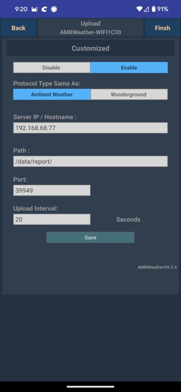

Simple process for collecting weather data from an Ambient Weather 2902 weather station into a MySql DB. All processing is done on the local network.

TLDR: Setup the Ambient Weather console to make periodic requests to a local HTTP server on your network. On your local server run a Python program to put up an HTTP server, receive the requests, parse the request parameters, and store them into a MySql DB.

Security note: Don't run this server on the open internet. There is no protection against things like SQL injection attacks. This code should only be run on your local network, which is hopefully free of malicious users. You have been warned.

Use *awnet* from your phone to tell the console to send periodic HTTP requests to an HTTP server on your local network. Here is an example settings page:

On your local server run *bin/weather.py*, either manually or as a service (for Linux see *service/Weather.service*). It takes two optional args:

bin/weather.py [DB file] [HTTP port]

That's it. Hopefully it will just work.

Notes:
<ol>
  <li>Python code is purposely simplistic to make maintenance easier.</li>
  <li>Code written to support a 2902a, I don't know if there are new/additional parameters for later models. If so, they should be easy to add.</li>
  <li>There is some SQL code to analyze the weather data looking for runs of rainy/windy/cold days in <i>bin/analyzeWeather.sh<i>.</li>
</ol>
